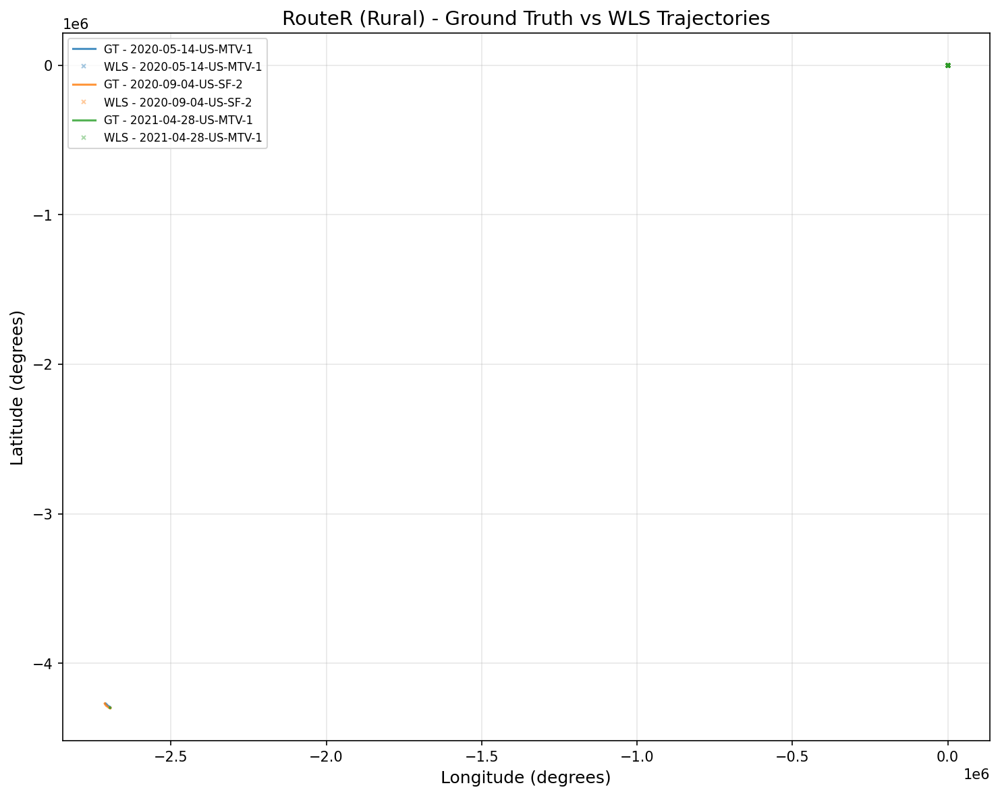
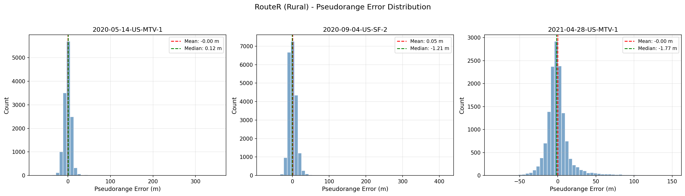
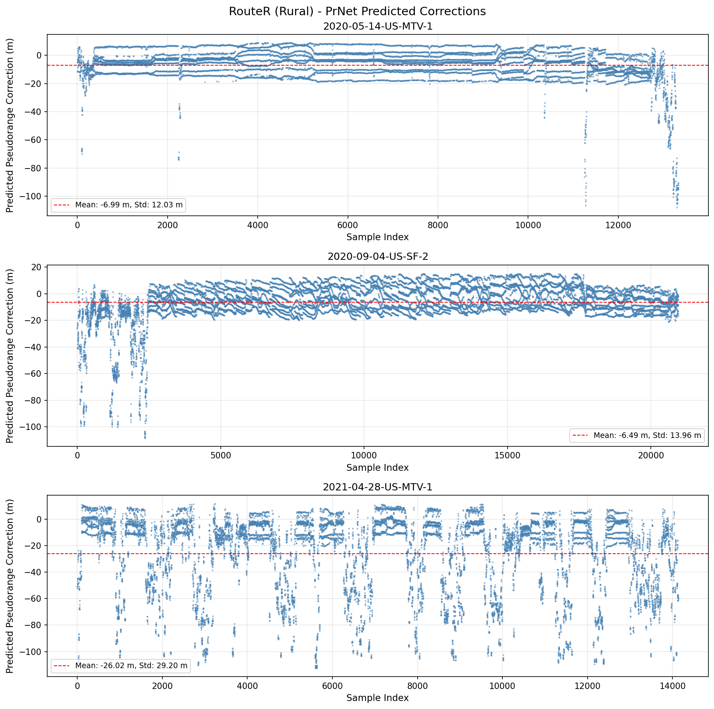
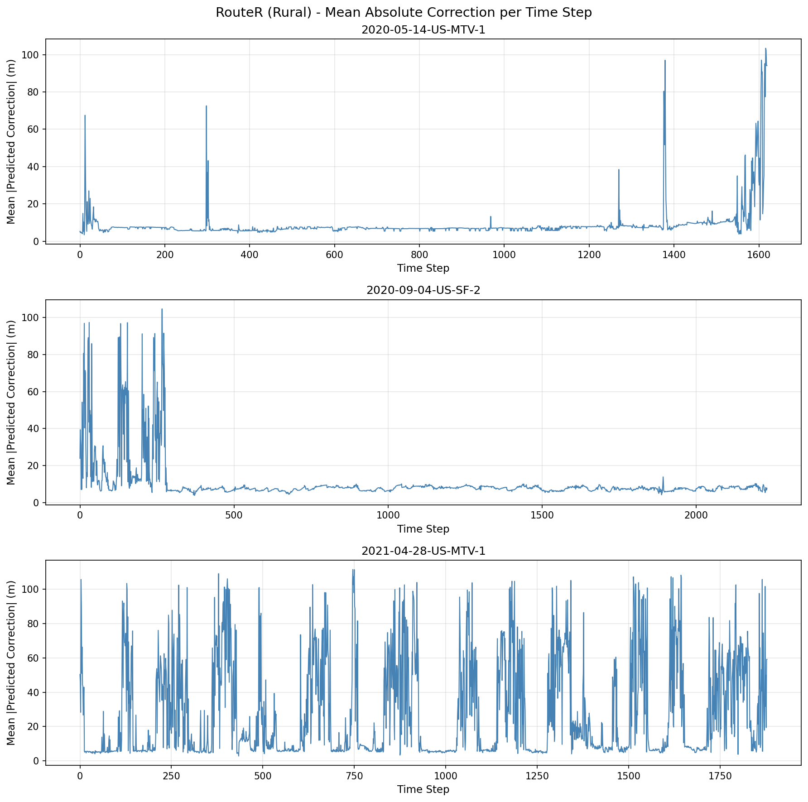
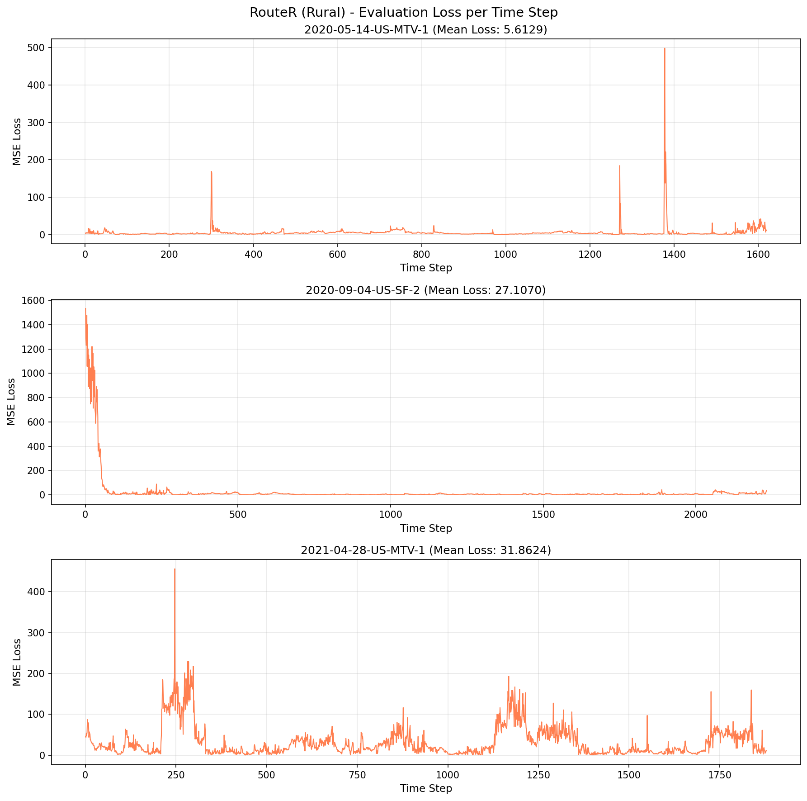
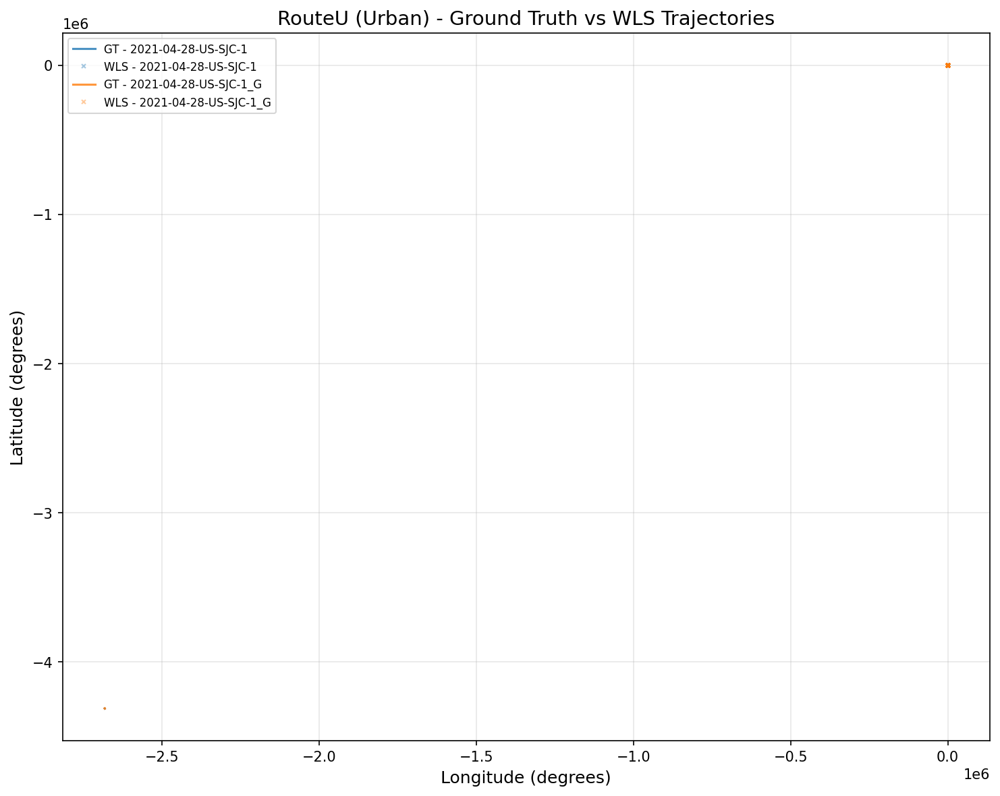
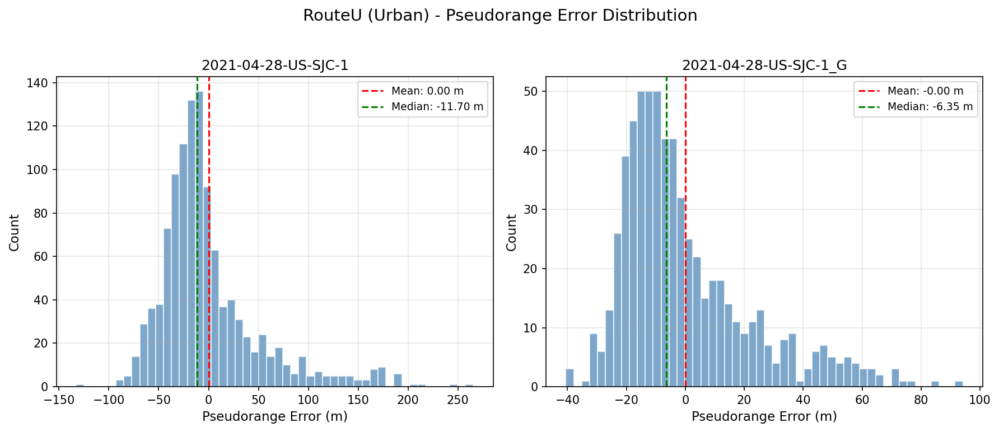
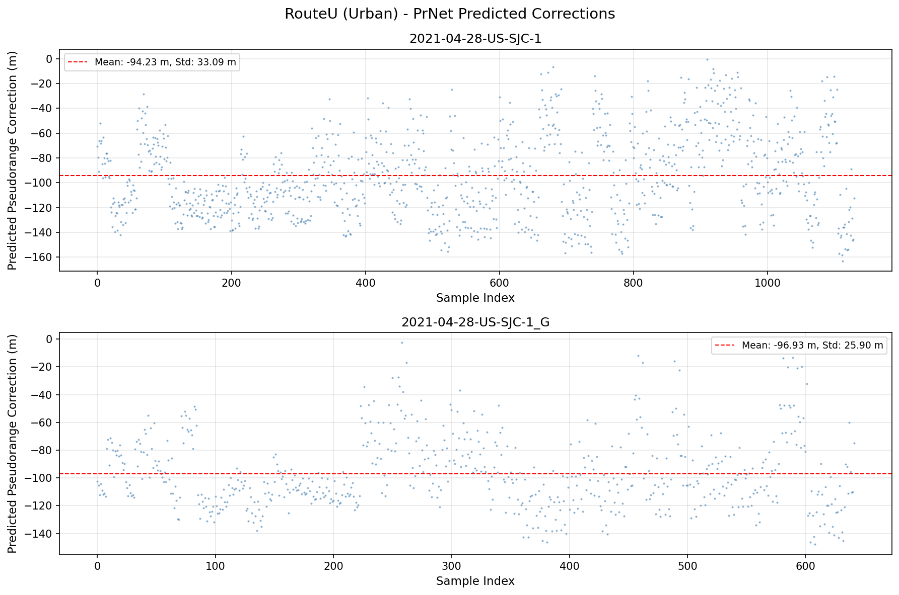
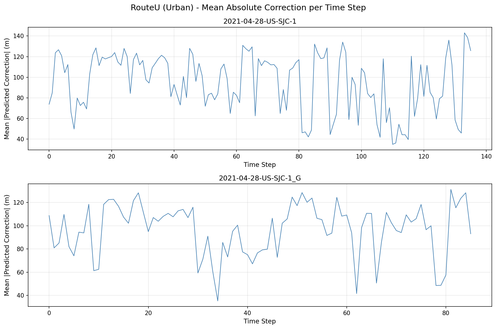
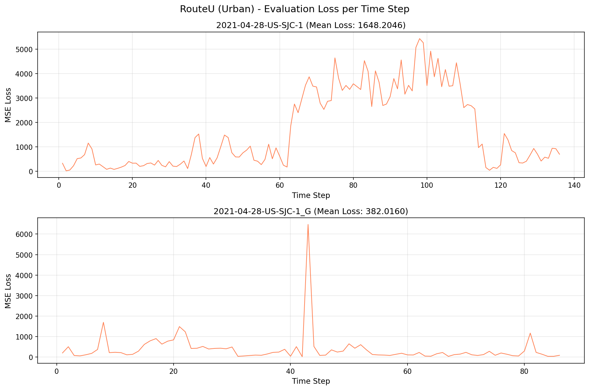

# PrNet Evaluation Report

**Date**: 2026-06-01 16:41:07

## Model Architecture

| Parameter | Value |
|-----------|-------|
| Model | PrNet (MLP-based) |
| Input Features | 16 (CN0, sinE, cosE, PRN, WLS positions, geometry vectors, heading) |
| Hidden Neurons | 40 |
| MLP Layers | 20 |
| Total Trainable Parameters | 31,881 |
| Dropout | 0 |

## Evaluation Results

### RouteR (Rural)

| Test File | # Epochs | # Samples | PR Error Mean (m) | PR Error Std (m) | PR Error Median (m) |
|-----------|----------|-----------|-------------------|------------------|---------------------|
| 2020-05-14-US-MTV-1 | 1620 | 13331 | -0.0000 | 11.1782 | 0.1235 |
| 2020-09-04-US-SF-2 | 2231 | 20956 | 0.0539 | 12.0922 | -1.2118 |
| 2021-04-28-US-MTV-1 | 1879 | 14134 | -0.0000 | 16.3983 | -1.7692 |

**PrNet Predicted Corrections:**

| Test File | Mean Correction (m) | Std Correction (m) | Min (m) | Max (m) |
|-----------|--------------------|--------------------|---------|---------|
| 2020-05-14-US-MTV-1 | -6.9934 | 12.0287 | -108.1513 | 9.0709 |
| 2020-09-04-US-SF-2 | -6.4945 | 13.9629 | -108.3805 | 15.4662 |
| 2021-04-28-US-MTV-1 | -26.0245 | 29.2045 | -112.7067 | 12.0256 |

### RouteU (Urban)

| Test File | # Epochs | # Samples | PR Error Mean (m) | PR Error Std (m) | PR Error Median (m) |
|-----------|----------|-----------|-------------------|------------------|---------------------|
| 2021-04-28-US-SJC-1 | 136 | 1130 | 0.0000 | 51.0091 | -11.7041 |
| 2021-04-28-US-SJC-1_G | 86 | 642 | -0.0000 | 22.2158 | -6.3497 |

**PrNet Predicted Corrections:**

| Test File | Mean Correction (m) | Std Correction (m) | Min (m) | Max (m) |
|-----------|--------------------|--------------------|---------|---------|
| 2021-04-28-US-SJC-1 | -94.2307 | 33.0938 | -163.0645 | -0.5713 |
| 2021-04-28-US-SJC-1_G | -96.9289 | 25.9028 | -147.7514 | -2.4825 |

## Generated Charts

### RouteR (Rural Area)

**Trajectory Plot:**

**Pseudorange Error Distribution:**

**PrNet Predicted Corrections:**

**Mean Absolute Correction per Time Step:**

**Evaluation Loss per Time Step:**

### RouteU (Urban Area)

**Trajectory Plot:**

**Pseudorange Error Distribution:**

**PrNet Predicted Corrections:**

**Mean Absolute Correction per Time Step:**

**Evaluation Loss per Time Step:**

## Notes

- Rural data uses `input_size=39`, Urban data uses `input_size=55`
- Evaluation uses batch_size=1 (one epoch per batch)
- Pre-trained weights from `Neural_Pseudorange_Correction/Weights/` are used
- All evaluations run on CPU
